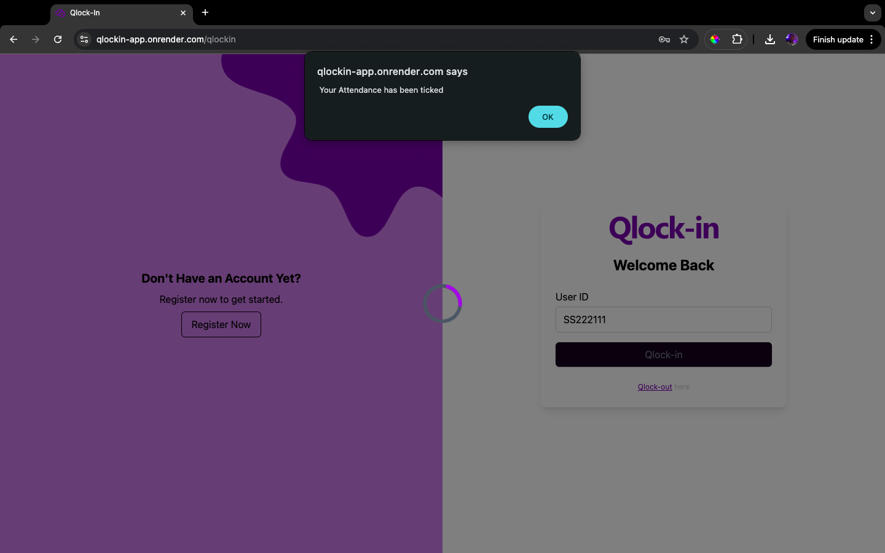
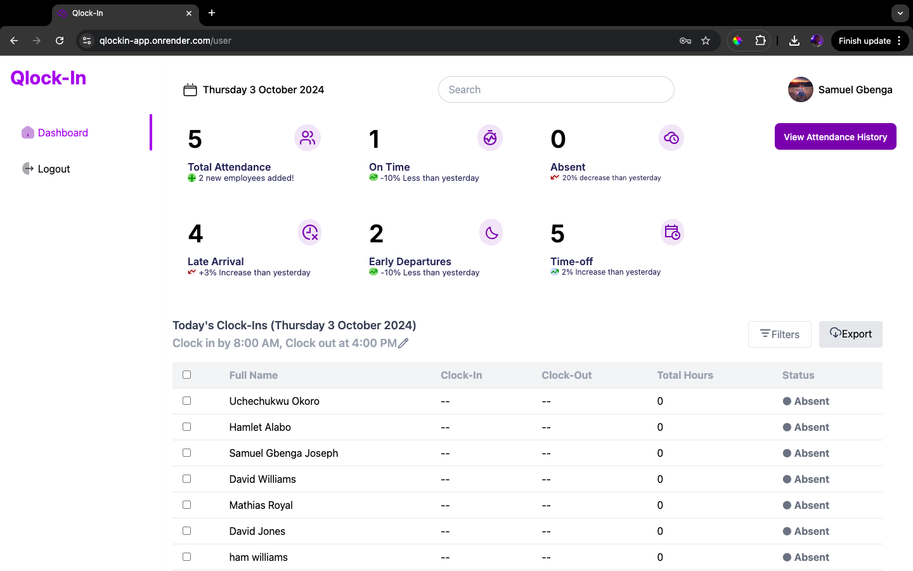

## Overview
Qlock-in is an innovative clock-in app designed to streamline attendance tracking for businesses. Utilizing digital face recognition, it facilitates a convenient and efficient clock-in and clock-out process for staff members. Ideal for use on tablets or small display units, Qlock-in ensures a secure and seamless experience at the entrance of any office building.

## Problem
Businesses often grapple with manual attendance tracking systems, leading to inefficiencies and potential errors. Qlock-in addresses this challenge by providing a digital solution that enables staff to clock in with their face, eliminating the need for traditional timekeeping methods.

## Solution
Qlock-in introduces a cutting-edge software solution that revolutionizes the clock-in and clock-out process through any form of Biometric verification on employee's mobile device, offering a secure and user-friendly experience for businesses.

## Goal
Qlock-in aims to be the preferred choice for businesses looking to enhance their attendance tracking process.

## Target Market
- Businesses of all sizes.
- Staff aged 17-50, particularly in urban areas like Lagos and Abuja.

## Features

### For the Manager/Admin
1. **Admin Login Portal**:
    - Secure login for admins to access and manage the platform.
    - Update Admin profile

2. **Admin Dashboard**:
    - Overview of important data, including:
        - Number of clock-ins (today)
        - Average clock-in time
        - Number of employees
        - Early Arrival
        - Absenteeism Rate
        - Overtime Hours
        - Latecomer rate

3. **Employee Database Management**:
    - Add and manage employee/user details (e.g., User ID, Name, Role).
    - Update Employee profile

4. **Set Clock-in/Clock-out Time**:
    - Define times for clock-in/out and track late arrivals.

5. **Overtime Report Generation**:
    - Generate reports on employee overtime hours.

6. **Activity Module**:
    - Monitor daily clock-in activities and late arrivals.

7. **Absenteeism Report Generation**:
    - Generate reports on absenteeism for employees.

8. **Latecomers Report Generation**:
    - Generate reports for employee tardiness.

9. **Dashboard summary**:
    - Contains the statistical summary of the daily attendance
    - also contains summary of all operation:
      - including no of added users 
      - no employees e.t.c

### For the Employee
1. **Biometric mode of verification Setup**:
    - Employee registration a passkey for the clock-in app on their device which can be facial-Id or Fingerprint.
      

2. **Clock-in with Face-Id or Fingerprint Capture**:
    - Employees clock in using face-Id or fingerprint and their unique user EmployeeID.
    - Steps include (Same for clock-out):
      - 
      - 
      - 
      - 

3. **Clock-out with Face-Id or Fingerprint Capture**:
    - Employees clock out using face-Id or fingerprint and their unique user EmployeeID.

# Employee Dashboard

Employees have access to several key features on their dashboard, including:

## View Clock-In History
- **Overtime Daily Attendance**: Employees can review their daily attendance records for the month, including any overtime worked.
- **Absenteeism Overview**: A report showing absenteeism trends for the entire year, including how much overtime was affected by absences.
- **Late Coming Report**: A yearly summary of late arrivals, detailing how many times an employee arrived late throughout the year.
- **Monthly Overtime Report**: A report summarizing overtime hours worked for the current month.

## View General Attendance
- Employees can check their attendance status for the current day and the previous 4 days.

## Profile Update
- Employees can update their personal information, such as contact details, directly through the dashboard.

## other Core Operations

### Add an Employee
To add a new employee to the system, follow these steps:

1. **Click on "Add Employee"**: Navigate to the designated section for adding employees in the admin dashboard.
2. **Input Employee Information**: Fill in the required fields with the new employee's details, including name, user ID, role, and other relevant information.
3. **Click on "Submit"**: Once all information is filled in, click the submit button to process the addition of the new employee.
4. **Email Notification**: An email will be automatically sent to the newly added employee's registered email address.
5. **Employee Receives Email**: The employee will receive a notification email prompting them to complete the registration.
6. **Register Pass Key**: The employee must register their pass key using biometric authentication for secure access to the application.
   

### Update Employee
To update an existing employee's information (Admin can also update there info similarly):

1. **Click on the Profile Picture**: Navigate to the employee's profile by clicking on their profile picture in the dashboard.
2. **Supply the Information to Update**: Enter the new details you wish to change, such as contact information, role, or other attributes.
3. **Click on "Submit Changes"**: After making the necessary updates, click on the button to submit the changes.
4. **Success Alert**: A success alert will appear, confirming that the update was successful.
   
   

### Filter Attendance List
You can filter attendance reports based on specific criteria:

- **Daily Attendance Report**: Filter attendance reports for up to the last 5 days.
- **Absenteeism Report**: Generate absenteeism reports for up to the last 4 months.
- **Latecomer Report**: Filter reports of latecomers for up to the last 4 months.
- **Overtime Report**: Filter overtime reports for up to the last 5 weeks.
- **e.g** 
  - Late comer filter
  
  - Over time filter
    

### Export (Download) Attendance Report Details
To download attendance report details:

1. **Click on the Export Button**: Navigate to the attendance page and find the export option.
2. **Download Attendance Report**: Click the button to download the report in your preferred format.
   

### Get Individual Employee Attendance History
To view an individual employee's attendance history:

1. **Click on "Employees" on the Side Navbar**: Locate the employees section in the navigation menu.
2. **Click on "View My Profile"**: Select the option to view your profile, which will redirect you to your attendance history.

### Reset Password Functionality
To reset your password, follow these steps:

1. **Click on "Forgot Password" on the Login Page**: Navigate to the login page and select the "Forgot Password" option.
2. **Supply Your Registered Email**: On the next page, enter the email address associated with your account.
3. **Click on "Send"**: Click the send button, and an email will be sent to the provided address with instructions.
4. **Check Your Email for the Reset Password Link**: Open your email inbox and locate the email with the reset password link.
5. **Go to the Link and Supply a New Password**: Follow the link to the password reset page, where you will enter your new password and confirmation password.
6. **Click on reset**
   
   
   

### Employee Dashboard Operations

The Employee dashboard contains a few features similar to those in the Admin dashboard, as described above, allowing for seamless management of personal and team attendance data

- **Update Personal Details**: Employees can update their personal information easily through their dashboard.
- **View General Attendance**: Access a summary of attendance data for the team.
- **View Personal History of Attendance**: Employees can review their attendance records and statistics at any time.

## Conclusion
Qlock-in provides a comprehensive solution for attendance tracking, ensuring ease of use for both administrators and employees. The features outlined above facilitate efficient management and enhance accountability within organizations.

## Competitors
Qlock-in distinguishes itself by prioritizing digital Biometric verification (face-Id and fingerprint) technology, providing a modern alternative for businesses seeking an advanced clock-in system.
